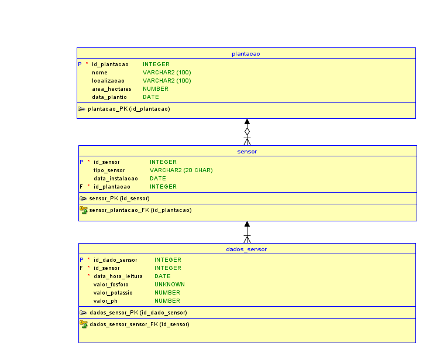

# FIAP - Faculdade de Informática e Administração Paulista

## Nome do projeto

**Agricultura Digital – Fase 2**

## Nome do grupo

FarmTech Solutions

### 👨‍💻 Integrantes:

- Italo Domingues – RM: 561787  
- Maison Wendrel Bezerra Ramos – RM: 565616  
- Felipe Cristovao da Silva – RM: 564288  
- Jocasta de Kacia Bortolacci – RM: 564730 – [GitHub](https://github.com/jojocamdb)

### 👨‍🏫 Professores:

**Tutor(a)**: Lucas Gomes Moreira  
**Coordenador(a)**: André Godoi Chiovato

---

## 📝 Descrição

Este projeto tem como objetivo modelar um banco de dados relacional para monitoramento de plantações utilizando sensores ambientais. Os sensores coletam dados em tempo real sobre os níveis de fósforo, potássio e pH do solo para otimizar a irrigação e aplicação de nutrientes, promovendo uma agricultura mais eficiente e sustentável.

A modelagem segue os princípios de um sistema relacional com relacionamentos 1:N e uso de PKs/FKs, permitindo consultas futuras como:  
- Histórico de variação de pH  
- Quantidade de nutrientes por plantação  
- Correlações entre localização e desempenho

---

## 📁 Estrutura de pastas

Dentre os arquivos e pastas presentes na raiz do projeto, definem-se:

| Pasta         | Conteúdo                                                                 |
|---------------|--------------------------------------------------------------------------|
| `.github/`    | Arquivos de configuração do GitHub que ajudam a automatizar processos.   |
| `assets/`     | Imagens e arquivos não estruturados. Inclui o DER exportado em PNG.      |
| `config/`     | Arquivos de configuração de parâmetros, se houver.                       |
| `document/`   | Arquivos principais como `modelo.xml` e `modelo.sql`.                    |
| `scripts/`    | Scripts auxiliares (ex: importação, migração de dados), se necessário.   |
| `src/`        | Código-fonte do projeto, se houver implementações.                       |
| `README.md`   | Este guia de estrutura e descrição do projeto.                           |

---

## 🗃️ Modelagem MER e DER

A estrutura foi desenvolvida com base nas seguintes entidades:

- **Plantacao**: representa o local físico do cultivo
- **Sensor**: sensores de umidade, pH ou nutrientes (NPK)
- **DadosSensor**: registros de leitura dos sensores com data, hora e valores

### Relacionamentos

- Uma `plantacao` possui vários `sensores`
- Cada `sensor` gera múltiplas entradas em `dados_sensor`

---

## 🖼️ DER – Diagrama Entidade Relacionamento

---

## 💾 Arquivos técnicos

- [`modelo.xml`](./document/modelo.xml): Arquivo de modelagem exportado do Oracle Data Modeler  
- [`modelo.sql`](./document/modelo.sql): Script de criação das tabelas e relacionamentos  
- [`diagrama.png`](./assets/diagrama.png): Imagem visual do DER

---

## 🛠️ Como executar o código

Este projeto não possui código-fonte executável, pois trata-se de uma modelagem conceitual. No entanto, os arquivos `.sql` podem ser utilizados para criar as tabelas em um SGBD como MySQL ou PostgreSQL, permitindo testes e inserção de dados simulados.

---

## 🕘 Histórico de versões

- v1.0 – 14/04/2025 – Entrega inicial do projeto Fase 2 / Capítulo 1

---

## 📄 Licença

Este projeto segue o modelo acadêmico FIAP e está licenciado sob [Atribuição 4.0 Internacional (CC BY 4.0)](https://creativecommons.org/licenses/by/4.0/).
